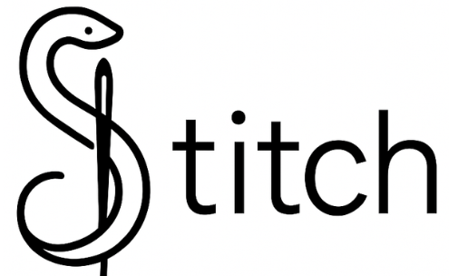

A type-safe RPC framework for Python that automatically generates JSON schemas from function signatures.

Stitch lets you define API procedures with Python type hints—whether you use `dataclasses`, `attrs`, `msgspec.Struct`, or `pydantic.BaseModel`—and automatically generates schemas for client validation and introspection. The client validates inputs against these schemas before making requests, providing type safety and clear error messages.

## Features

- **Automatic schema generation** from Python function signatures and type hints
- **Multi-model support** - works with `dataclasses`, `attrs`, `msgspec`, and `pydantic`
- **Input validation** - client validates parameters before making requests
- **Type-safe client** - prevents invalid API calls with runtime checks
- **Simple decorator-based API** - define procedures with `@query` and `@mutation`

## Current State (MVP)

This is a working MVP that provides:
- Router with decorators for defining procedures
- Schema extraction from function signatures
- Type-safe HTTP client with validation
- Support for complex return types and nested models

## Usage

### 1. Define API procedures with Router

```python
from dataclasses import dataclass
from stitch.router import Router

router = Router()

@dataclass
class User:
    id: int
    name: str
    email: str

@router.query()
def get_user(user_id: int) -> User:
    # Your implementation here
    return User(id=user_id, name="Alice", email="alice@example.com")

@router.query()
def search_users(query: str, limit: int = 10) -> list[User]:
    # Your implementation here
    return [User(id=1, name="Alice", email="alice@example.com")]

@router.mutation()
def create_user(name: str, email: str) -> User:
    # Your implementation here
    return User(id=123, name=name, email=email)

# Get the generated schema
schema = router.get_schema()
```

### 2. Expose schema endpoint in your web framework

The router generates a schema that needs to be exposed at a `/schema` endpoint:

```python
# FastAPI example
from fastapi import FastAPI

app = FastAPI()

@app.get("/schema")
def get_schema():
    return router.get_schema()

@app.get("/users/{user_id}")
def get_user_endpoint(user_id: int):
    return router.proc["get_user"]["handler"](user_id=user_id)
```

### 3. Use the type-safe client

```python
from stitch.client import Client

# Create client with base URL
client = Client("http://localhost:8000")

# Client fetches schema and validates inputs
try:
    # This validates that user_id is an integer and is required
    user = client.get("get_user", user_id=42)
    print(f"User: {user['name']}")

    # This would raise ValueError for missing required field
    # user = client.get("get_user")  # Missing user_id

    # This would raise ValueError for wrong type
    # user = client.get("get_user", user_id="invalid")  # user_id must be int

except ValueError as e:
    print(f"Validation error: {e}")
```

## Schema Example

The router automatically generates JSON schemas like this:

```json
{
  "get_user": {
    "schema": {
      "input": {
        "properties": {
          "user_id": {"type": "integer"}
        },
        "required": ["user_id"]
      },
      "output": {
        "$ref": "#/defs/User",
        "type": "dataclass"
      },
      "$defs": {
        "User": {
          "properties": {
            "id": {"type": "integer"},
            "name": {"type": "string"},
            "email": {"type": "string"}
          },
          "required": ["id", "name", "email"]
        }
      }
    }
  }
}
```

## Supported Model Types

Stitch automatically detects and works with:

- **dataclasses** - `@dataclass` decorated classes
- **Pydantic** - v1 and v2 models with `model_fields` or `__fields__`
- **msgspec** - classes with `__struct_fields__`
- **attrs** - classes with `__attrs_attrs__`

## Installation

```bash
pip install -e .  # Development installation
```

## Roadmap

Future enhancements planned:
- FastAPI integration with automatic endpoint mounting
- Async client support
- WebSocket procedures
- Auto-generated typed stubs
- Advanced schema validation features
